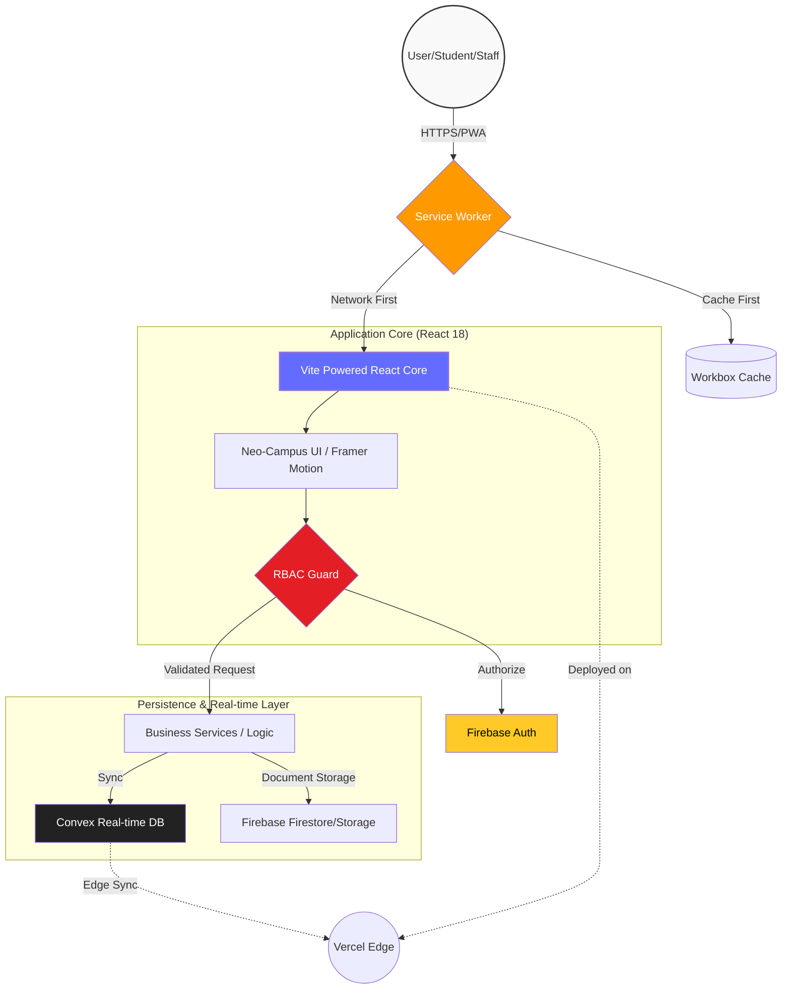

# 🛡️ Kushal Kumawat | Biyani Digital Campus System (BDCS)

[](https://bdcs-livid.vercel.app/)
[](https://vitejs.dev/)
[](https://firebase.google.com/)
[](./LICENSE)

---

> "Bridging the Gap Between Traditional Education Management and Advanced Web Engineering."

[LinkedIn](https://linkedin.com/in/kushal-ku) • [Source Code](https://github.com/Kushal96499/BDCS) • [Institutional Website](https://www.biyanicolleges.org/)

---

## 💎 The Engineering Philosophy

In the current era of digital transformation, **BDCS** serves as a **Privacy-First Institutional Hub**. Built during my 3rd year of BCA at Biyani Group of Colleges, this system replaces legacy, boxy management tools with a high-craft, resilient environment. By leveraging **Progressive Web App (PWA)** protocols and **Real-time Database Synchronization**, BDCS ensures that campus data is secure, fast, and accessible even under challenging network conditions.

### Core Strategic Pillars:
*   **PWA Resilience**: Offline-first architecture using Workbox strategies (`StaleWhileRevalidate`, `CacheFirst`).
*   **RBAC Architecture**: Strict Role-Based Access Control enforced at both Frontend (React Router) and Backend (Firebase Security Rules).
*   **Immersive UX**: High-performance UI utilizing **Glassmorphism** and `Framer Motion` for a "Neo-Campus" feel.
*   **Data Integrity**: Robust state management and real-time backend synchronization via **Convex** and **Firebase**.

---

## 🏗️ Technical Architecture & Workflow

The system utilizes a distributed architecture designed for low latency and high availability across all campus roles.



*Flow: User → Service Worker (PWA Shell) → React Core → Multi-cloud Persistence (Convex/Firebase)*

---

## 🚀 Interactive Feature Matrix

| Domain | Capabilities | Technology Stack |
| :--- | :--- | :--- |
| **Admin Control** | Global Settings, Campus Hierarchy, Course/Department Master | `React`, `Firebase`, `TailwindCSS` |
| **Academic Ledger** | Promotion States (Promoted/Backlogged), Grad Status, Semantic Tracking | `BatchPromotionService`, `Convex` |
| **Faculty Ops** | Real-time Attendance, Result Publishing, Bulk Student Uploads | `XLSX Engine`, `Lucide React` |
| **Student Hub** | Academic Timeline, Test History, Personal Project Showcase | `Framer Motion`, `React Dynamic Routes` |
| **PWA Engine** | Installation Prompt, Offline Recovery Shell, Aggressive Pre-caching | `Vite-PWA`, `Workbox` |

---

## 📂 Project Organization

```text
├── .github/            # CI/CD Workflows
├── public/             # Static Assets & PWA Icons
├── src/
│   ├── components/     # Atomized UI components (Common, Admin, Student)
│   ├── layouts/        # Role-based Portal Frameworks (5 Distinct Layouts)
│   ├── services/       # Core Business Logic & API Handlers
│   ├── hooks/          # Custom Context Hooks (Auth, Connectivity)
│   ├── config/         # System Configurations (Firebase, PWA)
│   └── App.jsx         # Global Route Orchestration & Connectivity Monitor
├── vite.config.js      # PWA Workbox Strategies & Build Optimization
└── tailwind.config.js  # "Neo-Campus" Design System Tokens
```

---

## 📸 Interface Showcase

*(High-resolution screenshots demonstrating the premium UI/UX)*

| 📱 Immersive Dashboard | 🔐 Secure Management |
| :---: | :---: |
|  |  |

---

## 🛡️ Institutional Security Protocol

This project is built exclusively for the **Biyani Digital Campus System**. Access to the source code and configuration is governed by strict institutional privacy standards.
- **Data Isolation**: Multi-tenant isolation for campus-specific data.
- **Audit Logs**: Comprehensive tracking of all administrative actions.
- **Zero-Trust**: Every request is validated via Firebase Authentication UIDs.

---

## 👤 Development Lead

**Kushal Kumawat**  
*Lead Full-Stack Developer | BCA 3rd Year*  
**Biyani Group of Colleges**

Expert in architecting secure, full-stack ecosystems. I specialize in bridging the gap between high-performance web development and robust institutional security.

---
*Built for the future of Biyani Digital Campus.*
